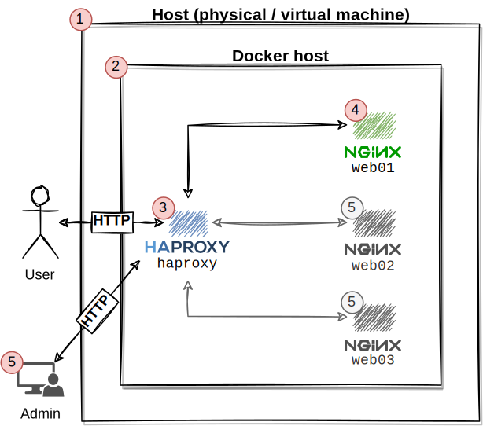

# Get Started with HAProxy Data Plane API on Docker

Related blog posts and documentations:

* [The New HAProxy Data Plane API: Two Examples of Programmatic Configuration](https://www.haproxy.com/blog/new-haproxy-data-plane-api/)
* [Dynamic Configuration with the HAProxy Runtime API](https://www.haproxy.com/blog/dynamic-configuration-haproxy-runtime-api/)
* [haproxytech/haproxy-docker-alpine](https://github.com/haproxytech/haproxy-docker-alpine)
* [HAProxy API](https://www.haproxy.com/documentation/hapee/2-2r1/api/)

**Summary.**
In this article, we deploy HAProxy, a popular load-balancer and proxy server for TCP and HTTP-based applications.
For this, we will work with a small sample backend consisting of three exemplary stateless applications to illustrate the basic functionality of load balancing.
A major focus of a load-balancer is distributing requests among a set of nodes.
Usually, load balancers need to be configured manually by editing a configuration file that might be error-prone and unhandy.
With Data Plane API, HAProxy offers a REST API to alter the configuration during runtime and without any downtime.

!! This is an example deployment that should show how it works in general and should not be used in production. This guide also outlines which aspects should be revised to get this architecture running in production.

## The Plan

### Architectural Proposal

In the following, we want to implement a typical load-balanced infrastructure with Docker, as shown in the first figure.



The following components are involved:

* **1:** A physical host or virtual machine is required. For testing purposes, this can be your local machine or a virtual machine (even running on your local system). This guide assumes a Linux installation, but it might also work with Windows.
* **2:** [Docker](https://www.docker.com/) as container platform. We will run all necessary components with the usage of lightweight containers. Therefore, Docker must be installed on the system and properly configured. Let's have a look at the following guide if you have never used Docker before: [Orientation and setup | Docker Documentation](https://docs.docker.com/get-started/).
* **3:** [HAProxy](http://www.haproxy.org/) as load balancer running in front of all backend containers. We will use a containerized version as well.
* **4:** Also, we need the backend containers responding to the actual requests. For simplicity, we take a basic [Nginx](https://hub.docker.com/_/nginx) container image and add a custom HTML file containing the container's hostname. In our example, this is `web0x` for all of the three containers we will use. Initially, we start with one single instance (`web01`).
* **5:** After setting up the basic load balancing, we dynamically remove and add backend containers that can process new requests. For this, we will issue REST calls via HTTP to HAProxy's Data Plane API.

### Requirements

* An up-to-date Linux distribution (e.g., Ubuntu 20.04)
* Working Docker installation ([Get Docker | Docker documentation](https://docs.docker.com/get-docker/))
* Experience with Docker and Docker Compose

## Implementation

For the implementation, we first set up the Nginx container(s) (**backend**), and finally, we configure HAProxy (our **frontend**) to forward requests to the different backend containers.

### Setup Nginx Containers (4)

#### Preparation

Creating the Nginx containers is simple.
Just create the following `docker-compose.yaml` file, for example, in a new directory named `get-started-with-haproxy-data-plane-api`:

```yaml
version: "3.8"

services:
  web01:
    image: "nginx:1.21.4"
    volumes:
      - "./web01.html:/usr/share/nginx/html/index.html:ro"
    ports:
      - "81:80"
    networks:
      - backend
  web02:
    image: "nginx:1.21.4"
    volumes:
      - "./web02.html:/usr/share/nginx/html/index.html:ro"
    ports:
      - "82:80"
    networks:
      - backend
  web03:
    image: "nginx:1.21.4"
    volumes:
      - "./web03.html:/usr/share/nginx/html/index.html:ro"
    ports:
      - "83:80"
    networks:
      - backend

networks:
  backend:
    driver: bridge 
```

There are a few things that are important to mention regarding our `docker-compose.yaml` file:

* Under `volumes`, a file named `web0X.html` is expected for all three Nginx containers. The content of this file is returned if we are requesting Nginx via HTTP. Without stating something, we would get the default Nginx page _(Welcome to Nginx! ...)_. Docker is looking in the same directory `./` for these HTML files. We will manually create these files.
* Currently, under `ports`, we are introducing a mapping, e.g., `81:80` for `web01`. This exposes all of the three containers on our system from `<src port>:<dest port>`. Internally, all Nginx containers are listening to `<dest port>` because they are bound to different internal IP addresses provided by the docker networking model. However, we need to define different `<src ports>` because the same port on our host can't be bound multiple times. As a result, all Nginx containers are accessible on the system, even without being proxied by HAProxy. **We will do that for demonstration purposes and will remove that later on when HAProxy is properly configured.**

Therefore, we need to create the following three HTML files: `web01.html`, `web02.html`, `web03.html`.

Filename: `web01.html`

```html
<!DOCTYPE html>
<html lang="en">
  <head>
    <meta charset="utf-8">
    <title>web01</title>
  </head>
  <body>
    {"backend_host": "web01"}
  </body>
</html>
```

Filename: `web02.html`

```html
<!DOCTYPE html>
<html lang="en">
  <head>
    <meta charset="utf-8">
    <title>web02</title>
  </head>
  <body>
    {"backend_host": "web02"}
  </body>
</html>
```

Filename: `web03.html`

```html
<!DOCTYPE html>
<html lang="en">
  <head>
    <meta charset="utf-8">
    <title>web03</title>
  </head>
  <body>
    {"backend_host": "web03"}
  </body>
</html>
```

As you might have noticed, they only differ in the value for `title` and `backend_host`.
This will help us to identify the backends later on when the load-balancer is in between.

Your directory structure should now look as follows:

```bash
$> tree
.
├── docker-compose.yaml
├── web01.html
├── web02.html
└── web03.html
```

#### Start the Nginx Containers

Before starting, make sure that no application is listening to port `81`, `82`, or `83`.
You can do that by going through the list you get by the following command:

```bash
$> sudo ss -tulpn | grep LISTEN
```

After this verification, we can start our deployment:

!!! This tutorial assumes that all commands are executed in the folder `get-started-with-haproxy-data-plane-api` as working directory.

```bash
$> sudo docker-compose up -d
Starting get-started-with-haproxy-data-plane-api_web02_1 ... done
Starting get-started-with-haproxy-data-plane-api_web01_1 ... done
Starting get-started-with-haproxy-data-plane-api_web03_1 ... done
```

Let's give it a try and check if all of our of our Nginx containers are working:

```bash
# web01
$> curl localhost:81

<!DOCTYPE html>
<html lang="en">
  <head>
    <meta charset="utf-8">
    <title>web01</title>
  </head>
  <body>
    {"backend_host": "web01"}
  </body>
</html>
```

```bash
# web02
$> curl localhost:82

<!DOCTYPE html>
<html lang="en">
  <head>
    <meta charset="utf-8">
    <title>web02</title>
  </head>
  <body>
    {"backend_host": "web02"}
  </body>
</html>
```

```bash
# web03
$> curl localhost:83

<!DOCTYPE html>
<html lang="en">
  <head>
    <meta charset="utf-8">
    <title>web03</title>
  </head>
  <body>
    {"backend_host": "web03"}
  </body>
</html>
```

!!!! All containers are reachable and working because we got the expected response.  That means our **backend** is configured correctly.

Now we can start with the configuration of HAProxy to realize the load-balancing between the Nginx containers.

### Setup HAProxy Container (3)

#### HAProxy Preparation

For setting up HAProxy, we will add another service to our docker-compose.yml file.
This is [haproxytech/haproxy-ubuntu:2.5](https://hub.docker.com/r/haproxytech/haproxy-ubuntu).
We need to modify the `docker-compose` file as follows:

```yaml
version: "3.8"

services:
  haproxy:
    image: "haproxytech/haproxy-ubuntu:2.5"
    volumes:
      - "./haproxy:/usr/local/etc/haproxy/"
    ports:
      - "80:80"
    networks:
      - frontend
      - backend
  web01:
    image: "nginx:1.21.4"
    volumes:
      - "./web01.html:/usr/share/nginx/html/index.html:ro"
    networks:
      - backend
  web02:
    image: "nginx:1.21.4"
    volumes:
      - "./web02.html:/usr/share/nginx/html/index.html:ro"
    networks:
      - backend
  web03:
    image: "nginx:1.21.4"
    volumes:
      - "./web03.html:/usr/share/nginx/html/index.html:ro"
    networks:
      - backend

networks:
  frontend:
    driver: bridge
  backend:
    driver: bridge 
```

In summary, we added the service definition for `haproxy`:

```yaml
  haproxy:
    image: "haproxytech/haproxy-ubuntu:2.5"
    volumes:
      - "./haproxy:/usr/local/etc/haproxy/"
    ports:
      - "80:80"
    networks:
      - frontend
      - backend
```

Also, we extended the `networks` section by an additional network `frontend`:

```yaml
  frontend:
    driver: bridge
```

In addition, we removed the ports declarations from `web01-web03`, because they are not needed anymore.

```yaml
    ports:
      - "83:80"
```

!!! We do not want to expose every single instance of `nginx` to public. So all the instances in the **backend** should only be accessible through `haproxy`. That is the reason why we removed this port mapping.

Again, there are a few things to mention:

* Under `volumes`, we added (according to the documentation) a bind mount that expects a directory `haproxy` in the current directory (`./`) with at least a file (`haproxy.cfg`) that contains a valid configuration for HAProxy. We will talk about that in the next section.
* Under `networks`, we also assigned a second network named `frontend`. The question now is, **Why do we need this additional network?**
Usually, only those services that belong together and are required to communicate should be put together in the same network.
This will instruct Docker to put them into the same subnet and allow them to communicate.
Other containers from different networks are not allowed to communicate (in terms of establishing a connection) to containers in foreign networks.
This is called network isolation and can drastically improve network security.
In the worst case, compromised containers can only communicate to a subset of container instances.
In our example, we put the `haproxy` container and the `nginx` containers into the same network (`backend`) because they must communicate.
Only `haproxy` will reside in an additional `frontend` network which might be extended over time with additional instances, for example, with additional instances of HAProxy that are required to communicate to achieve a proper failover.

#### Configuration of HAProxy

As already pointed out in the former section, we need to provide a working configuration for the `haproxy`.
For this, create the folder `haproxy` at first and then just a file named `haproxy.cfg` inside this folder.
You should have the following directory structure:

```bash
$> tree
.
├── docker-compose.yaml
├── haproxy
│   └── haproxy.cfg
├── web01.html
├── web02.html
└── web03.html
```

A general configuration looks like this:

```bash
global
    # global settings here

defaults
    # defaults here

frontend
    # a frontend that accepts requests from clients

backend
    # servers that fulfill the requests
```

We won't get into details here, but a few points are worth mentioning:

* Section `global`: In this section `haproxy-wide settings are configuration (e.g., general-, security-, and performance-related) settings.
* Section `defaults`: All settings in this area are automatically added to all `frontend` and `backend` sections. This can be, for example, configurations like the used protocol and timeouts.
* Section `frontend`: In this section (there can be multiple), basic connection-specific settings are defined to which the front is, for example listening to (IP address and port).
* Section `backend`: All the necessary information required to forward requests from a particular `frontend` section to a `backend` section goes into this section. This is typically a set of servers that a serving requests.

For our purposes, a simple configuration is enough.
We will shortly go through the configuration of the different sections:

Section `global`: Nothing required here at the moment.

Section `defaults`: Only a few basic settings which define timeouts for connection, server, and the client.

```bash
defaults
    # defaults here
    timeout connect 10s
    timeout client 30s
    timeout server 30s
```

Section `frontend`: We are achieving proxying of HTTP requests, HAProxy will listen to port 80, and requests are forwarded to a backend named `web-backend` that is defined in the next section.

```bash
frontend http
    # a frontend that accepts requests from clients
    mode http
    bind *:80
    default_backend web-backend
```

Section `backend`: We just define one single backend machine with a round-robin balancing mode for testing purposes. If we have multiple servers defined, HAProxy will request the set of servers on a rotational basis. In this situation, only `server s1 web01:80` is requested.

```bash
backend web-backend
  # servers that fulfill the requests
  mode http
  balance roundrobin
  server s1 web01:80
```

As you might have noticed, we are using the service name (`web01`) from the docker-compose file to define the address of our backend server. We can do that because HAProxy and all our Nginx containers are in the same docker network `backend`. We can use docker's internal DNS resolution if this is the case.

! If you are using the `default` bridge network provided by docker, DNS resolution does not work.
Your final configuration file `haproxy.cfg` located in the folder`haproxy` should look as follows:

```bash
global
    # global settings here

defaults
    # defaults here
    timeout connect 10s
    timeout client 30s
    timeout server 30s
    
frontend http
    # a frontend that accepts requests from clients
    mode http
    bind *:80
    default_backend web-backend
    
backend web-backend
  # servers that fulfill the requests
  mode http
  balance roundrobin
  server s1 web01:80
```

#### Start HAProxy

Now, we are ready to start our modified deployment. For this, just run `sudo docker-compose up -d` once again.
Then, we request HAProxy the first time:

```bash
$> curl localhost:80

<!DOCTYPE html>
<html lang="en">
  <head>
    <meta charset="utf-8">
    <title>web01</title>
  </head>
  <body>
    {"backend_host": "web01"}
  </body>
</html>
```

!!!! As you can see, we got a response from `haproxy` which is proxying the requests from/to `web01`.

### Advanced Load-Balancing

So far, we are just using HAProxy to proxy to one single **backend** server.
In the following, we will add the other instances to the `backend web-backend` section and achieve different types of load-balancing and proxying.
For this, stop the `haproxy` container at first: `docker-compose stop haproxy`

#### Adding More Servers with Round-robin Load-balancing

Then, edit the section `backend web-backend` in `haproxy.cfg` as follows:

```bash
backend web-backend
  # servers that fulfill the requests
  mode http
  balance roundrobin
  server s1 web01:80
  server s2 web02:80
  server s3 web03:80
```

Save the configuration changes, and start `haproxy` again: `sudo docker-compose up -d`.

Now, we test if all backends are reachable.
At most, three requests should be sufficient to check if every **backend** service responds because we applied round-robin load-balancing.

```bash
$> curl localhost:80

<!DOCTYPE html>
<html lang="en">
  <head>
    <meta charset="utf-8">
    <title>web01</title>
  </head>
  <body>
    {"backend_host": "web01"}
  </body>
</html>

$> curl localhost:80

<!DOCTYPE html>
<html lang="en">
  <head>
    <meta charset="utf-8">
    <title>web02</title>
  </head>
  <body>
    {"backend_host": "web02"}
  </body>
</html>

$> curl localhost:80

<!DOCTYPE html>
<html lang="en">
  <head>
    <meta charset="utf-8">
    <title>web03</title>
  </head>
  <body>
    {"backend_host": "web03"}
  </body>
</html>
```

!!!! As you can see, `haproxy` requests the backend servers on-by-one.

#### Load-balancing with Persistence

In some use cases, it is necessary to redirect a set of clients to the same backend server and to avoid the default round-robin load-balancing (for example, if backend servers do not share session information across the instances).
To redirect to the same backend server, we can instruct HAProxy to send a cookie to the client.
This can be done by adding the line `cookie SERVERID insert indirect nocache` to the `backend` block.
Furthermore, we need to append the cookie check (`check cookie s1`) for all servers in the backend.

```bash
backend web-backend
    # servers that fulfill the requests
    mode http
    balance roundrobin
    cookie SERVERID insert indirect nocache
    server s1 web01:80 check cookie s1 check cookie s1
    server s2 web02:80 check cookie s2 check cookie s2
    server s3 web03:80 check cookie s3 check cookie s3
```

!!! Note that you need to stop `haproxy` (`sudo docker-compose stop haproxy`), modify `haproxy.cfg`, and restart `haproxy` (`sudo docker-compose start haproxy`) again to enable the changes.

Now, we can check again, if the load balancing works:

```bash
$> curl -I -c /tmp/cookie localhost:80

HTTP/1.1 200 OK
server: nginx/1.21.4
date: Wed, 12 Jan 2022 23:42:56 GMT
content-type: text/html
content-length: 161
last-modified: Wed, 12 Jan 2022 23:28:01 GMT
etag: "61df6401-a1"
accept-ranges: bytes
set-cookie: SERVERID=s1; path=/
cache-control: private
```

Under `set_cookie`, haproxy `has injected SERVERID=s1; path=/` to preserve the target backend node.

!!! Note that you need to add `-c /tmp/cookie` to save the received cookie locally.

Subsequent requests (by attaching the just received cookie) lead to the following result:

```bash
$> curl -b /tmp/cookie localhost:80

<!DOCTYPE html>
<html lang="en">
  <head>
    <meta charset="utf-8">
    <title>web01</title>
  </head>
  <body>
    {"backend_host": "web01"}
  </body>
</html>

$> curl -b /tmp/cookie localhost:80

<!DOCTYPE html>
<html lang="en">
  <head>
    <meta charset="utf-8">
    <title>web01</title>
  </head>
  <body>
    {"backend_host": "web01"}
  </body>
</html>

$> curl -b /tmp/cookie localhost:80

<!DOCTYPE html>
<html lang="en">
  <head>
    <meta charset="utf-8">
    <title>web01</title>
  </head>
  <body>
    {"backend_host": "web01"}
  </body>
</html>
```

!!! Note that you need to add `-b /tmp/cookie` to attach the just received cookie to the request.

As you can see, managing persistence between client and server is an easy thing in HAProxy.
If you want to have more information on that topic, just have a look at this great blog post: [Load Balancing, Affinity, Persistence, Sticky Sessions: What You Need to Know](https://www.haproxy.com/de/blog/load-balancing-affinity-persistence-sticky-sessions-what-you-need-to-know/)

! Please be aware of that this method of achieving persistence has several downsides in comparison to (web)-application-managed session persistence/affinity. The blog post above introduces some of the downsides.

## HAProxy Data Plane API (5)

In the following, we will dynamically update the HAProxy configuration.
For this, we need to prepare HAProxy first.
After that, we will work with the Data Plane API and create, read, update, and delete new servers in the **backend** area.

### HAProxy DATA Plane Preparation

At first, stop `haproxy`again and edit `haproxy.cfg` once again.

Add the following to the configuration:

```bash
userlist haproxy-dataplaneapi
  user admin insecure-password password

program api
  command /usr/bin/dataplaneapi --host 0.0.0.0 --port 5555 --haproxy-bin /usr/sbin/haproxy --config-file /usr/local/etc/haproxy/haproxy.cfg --reload-cmd "kill -SIGUSR2 1" --reload-delay 5 --userlist haproxy-dataplaneapi
  no option start-on-reload
```

!! Do not use this in production. It is never a good idea to use plain passwords in configuration files. Secondly, we are going to expose the Data Plane API publicly. This should be done in an isolated network, or at least bound to localhost only.

In the next step, we need to modify our `haproxy` service.
In detail, we are required to expose port `5555` besides the already exposed port `80`.
Corresponding part in `docker-compose.yaml:

```yaml
  haproxy:
    image: "haproxytech/haproxy-ubuntu:2.5"
    volumes:
      - "./haproxy:/usr/local/etc/haproxy/"
    ports:
      - "80:80"
      - "5555:5555"
    networks:
      - frontend
      - backend
```

Start `haproxy` again with `docker-compose up -d`.

### Use the API

In the following, we will work with the previously configured API. We use curl to perform HTTP/REST requests to get the information.
This allows us to understand how the API is structured and how it is working.
Later on, you can use the API programmatically, for example, by performing requests via Python or Java.
We will handle the following operation:

* Get all backends
* Get all defined servers from a particular backend
* Delete a server from a particular backend
* Create a server in a particular backend

#### Get all Backends

```bash
$> curl --get --user admin:password http://localhost:5555/v2/services/haproxy/configuration/backends

{
   "_version":1,
   "data":[
      {
         "balance":{
            "algorithm":"roundrobin"
         },
         "mode":"http",
         "name":"web-backend"
      }
   ]
}
```

!!!! This is exactly what we have configured in `haproxy.cfg` for the section `web-backend`.

#### Get all Existing Servers Defined in the Backend

Query the API again, take `web-backend` as an argument for `backend` (that is the value of `name`).

```bash
$> curl --get --user admin:password http://localhost:5555/v2/services/haproxy/configuration/servers?backend=web-backend

{
   "_version":1,
   "data":[
      {
         "address":"web01",
         "name":"s1",
         "port":80,
         "proxy-v2-options":null
      },
      {
         "address":"web02",
         "name":"s2",
         "port":80,
         "proxy-v2-options":null
      },
      {
         "address":"web03",
         "name":"s3",
         "port":80,
         "proxy-v2-options":null
      }
   ]
}
```

!!!! This is exactly what we have configured in `haproxy.cfg` in section `backend`.

#### Delete a Server Defined in the Backend

Now, we will delete server `s3` from the backend section.

```bash
$> curl -X DELETE --user admin:password "http://localhost:5555/v2/services/haproxy/configuration/servers/s3?backend=web-backend&version=1"
Intentionally, no response after a DELETE.
```

!!! Make sure that you pass a valid value for `name`, `backend`, and `version`. Especially `version` must match the current version of the `haproxy` configuration. To obtain the up-to-date `version`, I highly recommend performing a prior read request, as shown in the example before.

```bash
$> curl --get --user admin:password http://localhost:5555/v2/services/haproxy/configuration/servers?backend=web-backend

{
   "_version":2,
   "data":[
      {
         "address":"web01",
         "name":"s1",
         "port":80,
         "proxy-v2-options":null
      },
      {
         "address":"web02",
         "name":"s2",
         "port":80,
         "proxy-v2-options":null
      }
   ]
}
```

!!!! We successfully removed server `s3`. Futhermore, we can find that `version` has increased by one due to our update.

#### Create a New Server

Lastly, we will add a new server (namely `s3` which was just removed).

```bash
$> curl -X POST --user admin:password -H "Content-Type: application/json" -d '{"name": "s3", "address": "web03", "port": 80}' "http://localhost:5555/v2/services/haproxy/configuration/servers?backend=web-backend&version=2"

{
   "address":"web03",
   "name":"s3",
   "port":80,
   "proxy-v2-options":null
}
```

!!! Make sure you are trying to add valid data to the request and that the `version` is equal to the up-to-date `version`.

Verify the result:

```bash
$> curl --get --user admin:password http://localhost:5555/v2/services/haproxy/configuration/servers?backend=web-backend

{
   "_version":3,
   "data":[
      {
         "address":"web01",
         "name":"s1",
         "port":80,
         "proxy-v2-options":null
      },
      {
         "address":"web02",
         "name":"s2",
         "port":80,
         "proxy-v2-options":null
      },
      {
         "address":"web03",
         "name":"s3",
         "port":80,
         "proxy-v2-options":null
      }
   ]
}
```

!!!! Server `s3` was successfully added. Similar to the last write operations, the `version` was incremented as well.

### Summary

In this tutorial, we built a very basic load-balancing architecture with Docker, HAProxy, and three replicas of Nginx.
In addition, we configured the HAProxy's Data Plane API to modify the configuration during runtime and without.
Finally, a few remarks:

* There are lot of other possibilities HAProxy's Data Plane API. We only covered the most important ones API queries. Get the full [HAProxy API](https://www.haproxy.com/documentation/hapee/2-2r1/api/).
* This guide is not really usable for production environments. For example, we exposed the Data Plane API to public and used an insecure plain-text password. If you want to run everything in production, you need to introduce network isolation. Furthermore, everything was performed on one single machine. Usually, load balancers and backend nodes are distributed over a large set of independent machines.
